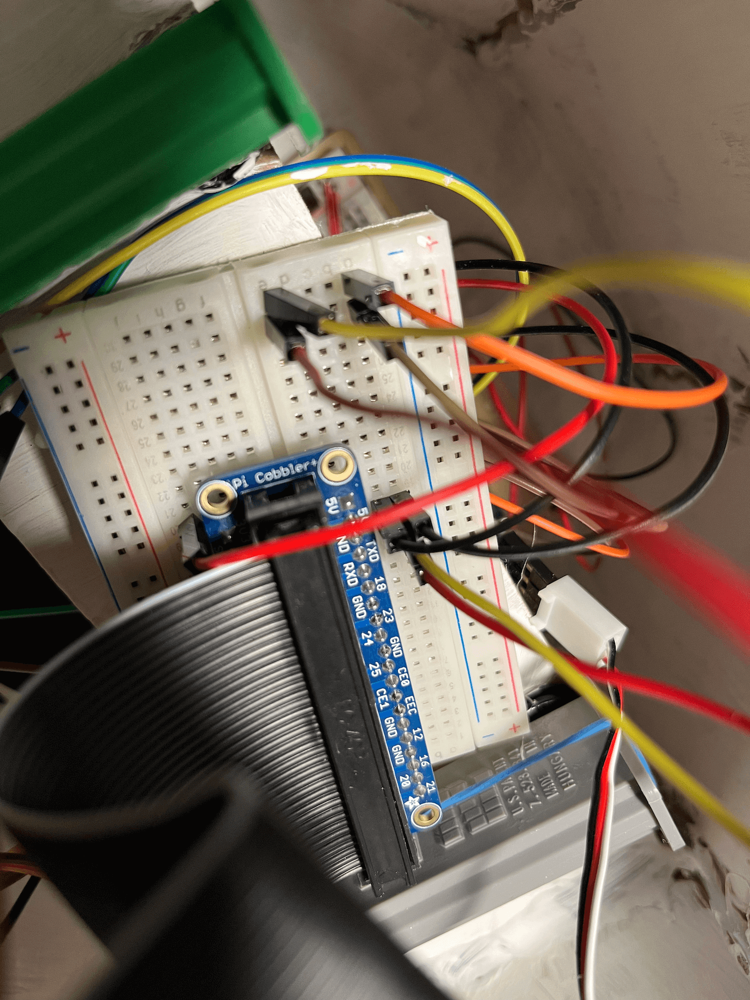
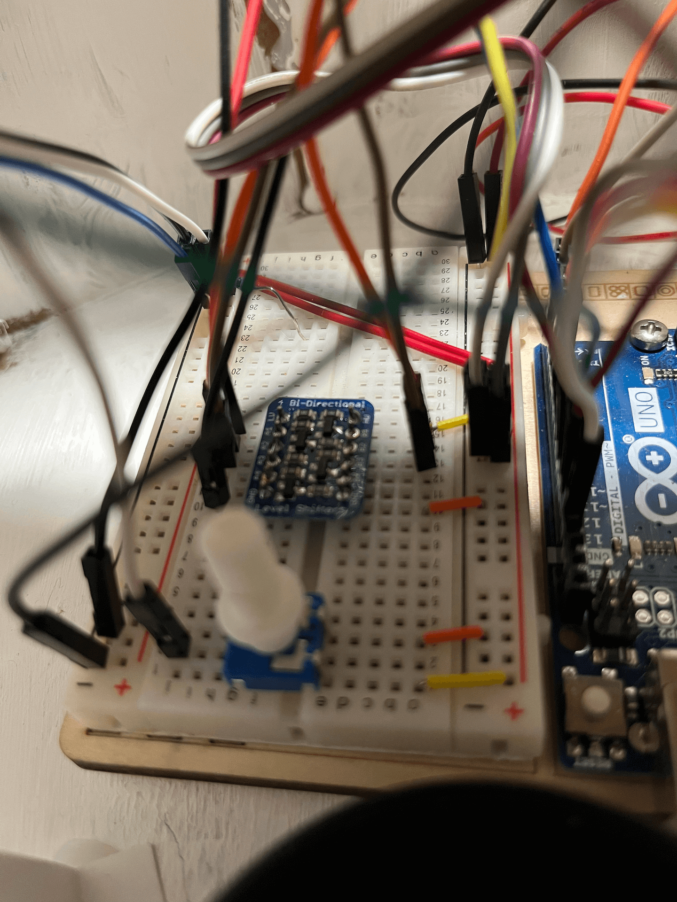
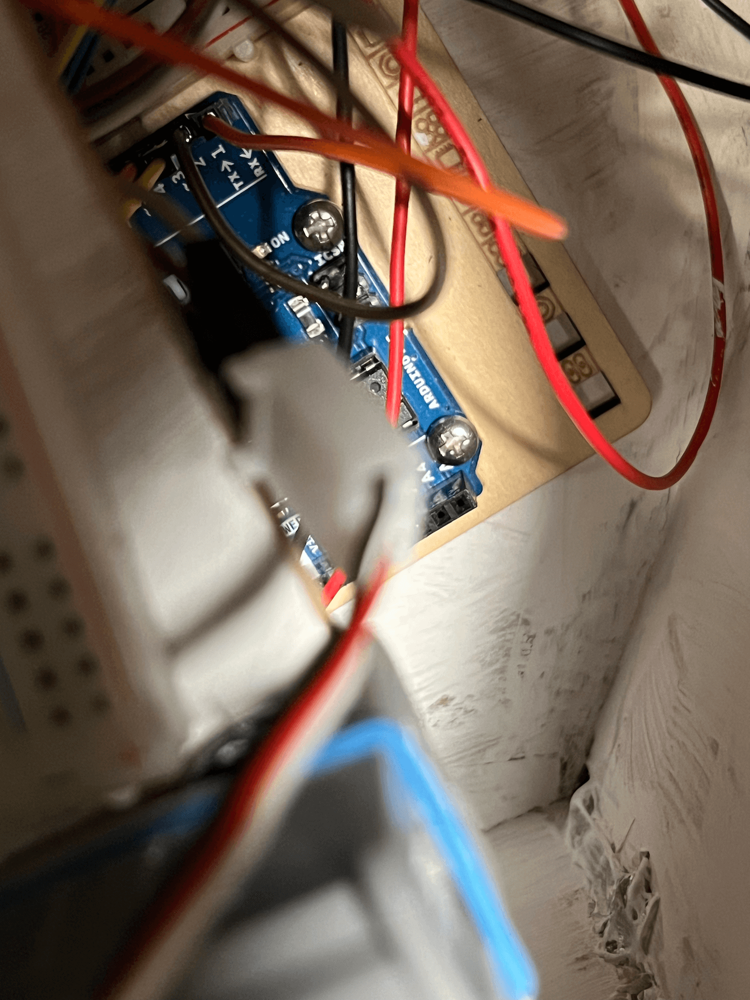

# Pill-aid

SE-101 Project

## Project Summary

Our idea is to create a pill dispenser that simplifies routine medicine-taking. Using our complimentary interface, the user can input the types of medicine they need to take, the dosage, and the time(s) at which they need to take them. Then, at the specified time(s), the dispenser will notify the user using an alarm. After confirming the user’s identity through facial recognition, it will release all of the pills as needed.

## Repo Structure

This repo is a monorepo with the separate "packages" in the "services" directory

## Requirements

-   Node JS (best if 16+)
-   npm
-   pnpm (`npm i -g pnpm`)
    -   Use pnpm for package management
-   clang-format (15)
-   Python Software Foundation's Black formatter
-   Python 3.4
-   Arduino

## Note for Future

Here's how the PI communicates with the Arduino:

TX from the PI goes into the logic level converter, then into the RX on the Arduino. Similarly, RX from the PI goes into the converter, and into TX on the Arduino.

The Arduino cannot be programmed unless the PI is off or the RX and TX pins are disconnected.
